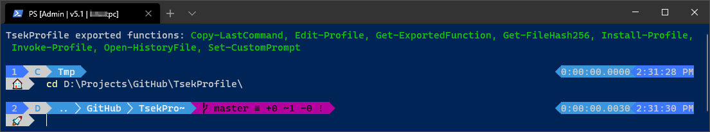
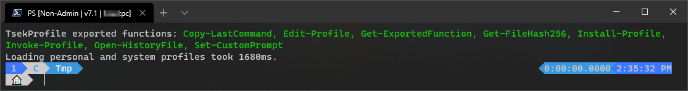

# TsekProfile

[](https://github.com/PowerShell/PowerShell)
[](https://github.com/TsekNet/TsekProfile/blob/master/LICENSE)
[](https://github.com/TsekNet/TsekProfile/actions?query=workflow%3AWindows-Build)

<p align="center">
    
</p>

TsekProfile is a PowerShell profile that adds built-in functionality to your
PowerShell experience.

See my [blog post](https://tseknet.com/blog/psprofile) about for more
information.

## Installation

This module will be published on the PowerShell Gallery. The steps will be as follows:

```powershell
# Install TsekProfile from the PowerShell Gallery
Install-Module -Name TsekProfile -Repository PSGallery -Scope CurrentUser

# Copy the TsekNet PowerShell profile to the appropriate location and execute
Install-Profile
```

## Usage

TsekProfile leverages [platyPS](https://github.com/PowerShell/platyPS) to
automatically generate Markdown documentation. See [docs](/docs/TsekProfile.md) to get started.

## Screenshots

PowerShell running in an administrative window while working on a git repo



PowerShell running in a non-admin window while working in `C:\Tmp`



## Included Modules

The following (awesome) modules will be installed by default:

1. [posh-git](https://github.com/dahlbyk/posh-git): Integrates Git and
   PowerShell by providing Git status summary information
1. [oh-my-posh](https://github.com/JanDeDobbeleer/oh-my-posh): Theme engine for
   PowerShell
1. [Get-ChildItemColor](https://github.com/joonro/Get-ChildItemColor): Provides
   colorization of outputs of `Get-ChildItem` Cmdlet of PowerShell
1. [PSWriteHTML](https://github.com/EvotecIT/PSWriteHTML): Output PowerShell
   commands to a formatted HTML page

## Contributing
Pull requests are welcome. For major changes, please open an issue first to discuss what you would like to change.

Please make sure to update tests as appropriate.

## License
[MIT](https://choosealicense.com/licenses/mit/)